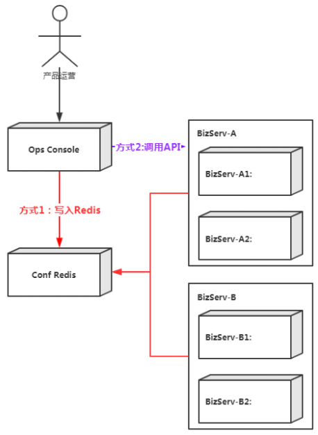

运营后台是每个App标配的管理后台，其功能定位是**面向产品运营同学提供统一业务配置和生效服务**，目前的配置生效的流程有两种：

### 方式1
运营后台将配置写入Redis，业务服务（BizServ）从Redis中读取。引入的问题：
* BizServ的基本配置都需要从ConfRedis中读取，一旦ConfRedis出现问题会中断BizServ的请求处理，可用性隐患严重。
* 基础配置存储在Redis中，性能低。

### 方式2
运营后台将配置通过BizServ接口写入。引入的问题：
* 运营后台功能开发无法与BizServ配置解耦，严重影响开发效率
* BizServ多实例时需要重复实现配置更新功能。
* 需要额外提供接口增加BizServ开发量和运营后台的维护量。
