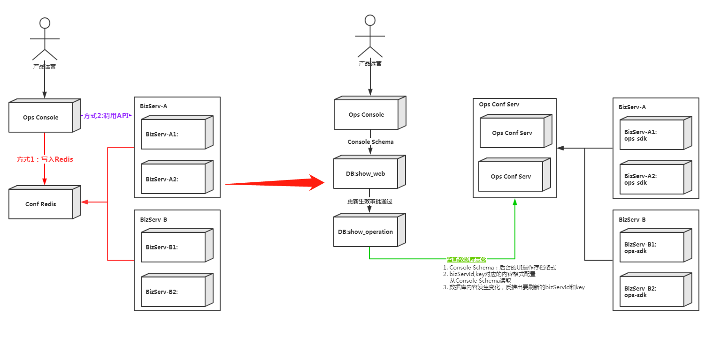

## 功能抽象
运营后台的需求可以归为以下几类：
 1. BizServ的全局配置，如礼物配置、活动配置等。
 2. BizServ的用户级配置，如入口白名单、回放白名单（含回放连接属性）、消费黑名单（含禁用日期等额外属性）等。 /注意：存在bizServ修改用户级配置/ （如取消回放白名单）。
 3. 运营后台调BizServ API，如发放钻石、发放包裹物品、发送Push消息等。

## 方案设计
#### 新旧方案对比

变化要点：
* 将Conf Redis替换为 Conf Serv
* 提供ops-sdk及时刷新appserv的进程内配置缓存

#### Ops SDK
* listBizConfItemKeys(bizServId)。查询所有的配置项key 。
* queryBizConfItem(bizServId,key)。查询配置项。
* queryUserConf(bizServId,uid) 。查询用户配置项。
* setUserConf(bisServId,uid,props)。bizServ设置用户属性。
* subscribeUpdateEvent()。订阅更新事件（bizServ不可见），仅用于ops-sdk和conf serv之间的通讯。
* refreshCache()。刷新本地缓存。（bizServ不可见）。

注意：sdk instance初始化要指定bizServId进行配置加载预热，可以指定多个bisServId。指定bizServId后subscribeUpdateEvent则主动关注更新。

#### Ops Console
* 承接产品运营的管理面板开发。
* 将配置按照BizServ约定的格式广播至ops conf serv。

#### Ops Conf Serv
* 承接运营后台的配置更新事件。
* 接受ops-sdk的订阅、查询以及用户配置变更修改等。

####  开发步骤
* BizConf
	* 运营后台开发、BizServ开发约定好Key和对应的配置内容格式。
	* 运营后台开发根据后台UI进行数据库设计和管理面板开发。
	* 运营后台开发按照约定的Key和配置项内容格式，广播配置内容更新事件。
	     __注意：__   console的   数据库Schema  和   BizServ配置格式    可以不一致，console的表主要是方便UI，和bizServ的约定格式主要是方便BizServ取值!! 。
	* BizServ收到配置更新事件，通过Ops-SDK取到预期的配置内容。
* UserConf
	* 运营后台开发、BizServ开发约定好用户配置的扩展属性（如过期时间、回放地址等）
	* 运营后台开发，开发控制面板进行用户添加、属性修改、删除和查询。
	* BizServ通过ops-sdk的queryUserConf(bizServId,uid)直接获取用户的信息。
	* BizServ需要或者删除时可以直接调用ops-sdk的setUserConf(bisServId,uid,props)，仅覆盖指定的项。
